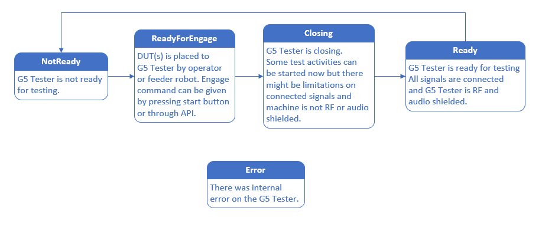

# .NET Client library for JOT Automation Gaia platform machines

## Installation

Preferred way is to use [nuget](https://www.nuget.org/packages/JOT.GaiaClient/) package. 

## Usage

See example program [here](https://github.com/jotautomation/gaiadotnetclient/blob/master/Example/Program.cs).

See API quick start bellow for more information about the API.

On .NET client you will have applications on dictionary. Inside each application on the dictionary there is another dictionary containing the actions for the application. For simple actions you can use simply name of action to call it. For example `client.Applications["SideButtonPusher"].Actions["Push"]();` will activate the side button pusher. 

For more complex action you need to add also some fields. So for example recording of wave (audio or other signal) you use this kind of command:  `client.Applications["WaveRecorder"].Actions["record-wave"](new Dictionary<string, object> { { "time_s", 2 }, { "filename", "testrecord.wav" } });` 

Robot controlling is special case on that sense that the payload on API there is g-code in a plain text form. This is how you execute a robot run `client.Applications["MainRobot"].Actions["cnc_run"](plainText: "G-CODE AS PLAIN TEXT");`

# JOT Gaia API quick start

## What it is?

Low-ceremony, simple and self-assisting RestFul API for controlling JOT Automation Gaia platform testers.

### Browse the API

Use any web browser to browse through the API. Responses are in a JSON format so if your browser doesn't pretty print JSON automatically, you may want to install an extension that will do it for you. And yes everything you can do with the API is readable from the API itself.

Gaia API follows [Siren](https://github.com/kevinswiber/siren) with some additions.

API is found from address [URL]/api, where URL is URL to your gaia machine or virtual gaia instance.

## Applications

Every piece of hardware you want to control is an application. To list applications make GET request to URL/api/applications. You will get list of entities i.e. applications. To get more information about the application make GET request to "href". Now you will get all information about the application. To control the application see list of  actions on response.

When you need to change state of entity (remember action is an entity), run robot movement or execute any other action, you need to find action field of the entity. Every action has the same structure.

Action defines always:
 - name (name is unique in the context of the gaia machine)
 - href (URL of the action)
 - fields (see bellow)
 - type (content type, almost always application/json)
 - method (POST or GET)
 - title (Description of what the action does)

 If there is limited amount of options on fields they all are listed.

Here I will list some applications types. This is not a comprehensive list of applications. The API itself will guide you to control any type of application and if you need assistance we are happy to help you.

### Stateful applications

Stateful application is type of application that defines limited number of states. In most cases there is two states: work/home, open/close etc.

### CNC robot

CNC robot application is type of application that is able to execute robot movements defined as G-code.

#### Stateful application action example

Here is an example of a stateful application action (Snip from GET http://URL/api/applications/BatteryConnector response)

    {
      "type": "application/json",
      "href": "http://URL/api/applications/BatteryConnector/state",
      "requiredActions": {},
      "method": "POST",
      "stateConditions": {},
      "title": "Trigger state change to Home",
      "name": "set-Home",
      "fields": [
                  {
                    "type": "text",
                    "name": "value",
                    "value": "Home"
                   }
                ]
    }

As you see there is some additional fields compared to standard action response. Those are used mainly for UI and can be omitted now. We are mainly interested on fields. To "trigger state change to Home"(title) you need to POST(method) to URL(href) with JSON(type) body containing field (fields) that has name "value" with value "Home". The whole command with cURL tool:

    curl -X POST -H "Content-Type: application/json" -d '{"value":"Work"}' http://URL/api/applications/BatteryConnector/state

#### CNC robot application

Here is an example of a cnc application action (Snip from GET http://URL/api/applications/MainRobot response)

    {
      "title": "Execute CNC/G-code run",
      "href": "http://URL/api/applications/MainRobot/cnc_run",
      "type": "text/plain",
      "method": "POST",
      "name": "cnc_run",
      "fields": [
                  {
                  "type": "text",
                  "name": "G-code"
                  }
                ]
    }

To "execute CNC/G-code run"(title) you need to POST(method) to URL(href) with text/plain(type) body containing G-code. The whole command with cURL tool:

    curl -X POST -H "Content-Type: text/plain" -d 'N010 G01 X133.964 Y41.984 Z73.5' http://URL/api/applications/MainRobot/cnc_run

This example contains only one line of G-code. Real G-codes are of course longer. Whole G-code is sent as is with linux line endings.

Tool to use with G-code can be set with comment line before real G-code starts. Syntax is "(ToolToUse:Finger1)" without quotes.

#### State actions

State actions do change state of main state machine. State actions are found from http://URL/api.

#### Blocked actions vs actions

If it is not allowed to execute the action, the action is listed under blocked actions instead of actions.

## G5 State Machine

## Client examples

We have created free open-source clients to help the integration work. Find clients with example code here:

 - [.NET/C#](https://github.com/jotautomation/gaiadotnetclient)
 - [Python](https://github.com/jotautomation/gaiapythonclient)

## Tips to create your own client

Keep it simple. As you can see from our examples we don't define application or action types on client side. Instead we call applications and actions by name. This way client side is super thin and still capable of controlling any application. Thus you don't need to introduce new application type on client side when new application type is introduced on server side.

